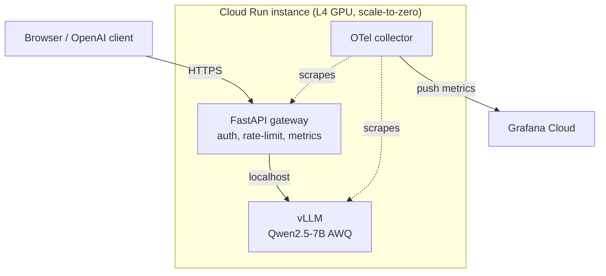

# Qwen Serve


A small but production-shaped LLM service. It runs Qwen2.5-7B on a cloud GPU and serves it through
an OpenAI-compatible API, with a chat UI on top. It scales to zero, so it costs about nothing when
nobody is using it.

Built by Shiba Wang. [shibawang.ca](https://shibawang.ca) · s2259wan@uwaterloo.ca

**Live demo:** https://llm-inference-692806119236.us-central1.run.app

Open it and start typing, no key needed. The first message after it has been idle takes about a
minute while the GPU wakes up and loads the model. After that it is quick.


## What it does

- Serves Qwen2.5-7B (4-bit AWQ) with vLLM on an NVIDIA L4 GPU.
- OpenAI-compatible, so any OpenAI client works. Just point it at the URL:
  ```bash
  curl $URL/v1/chat/completions \
    -H "Authorization: Bearer $KEY" -H "Content-Type: application/json" \
    -d '{"model":"Qwen2.5-7B-Instruct","messages":[{"role":"user","content":"hi"}],"stream":true}'
  ```
- Streaming (SSE) and non-streaming, API-key auth, rate limiting, health checks, Prometheus metrics.
- Scale to zero on Cloud Run, so idle cost is roughly $0.
- Ships through GitHub Actions: lint, type-check, test, build, deploy, smoke test, and a k6
  load-test gate.

## How it's built



The gateway (FastAPI) sits in front of vLLM's own OpenAI server. It does auth, rate limiting, and
metrics, then forwards the request to vLLM on localhost. Keeping vLLM behind its stable HTTP API
means version upgrades don't break us, and the whole gateway runs against a fake backend locally
with no GPU. More detail in [docs/architecture.md](docs/architecture.md).

| Layer | Tool |
|-------|------|
| Model | Qwen2.5-7B-Instruct, AWQ INT4 |
| Inference | vLLM (PagedAttention, continuous batching) |
| API + UI | FastAPI, plain HTML/JS chat |
| Container | Docker (CUDA base, weights baked in) |
| Deploy | GCP Cloud Run, L4 GPU, scale-to-zero |
| Metrics | Prometheus + OpenTelemetry, Grafana Cloud, Langfuse |
| CI/CD | GitHub Actions, Cloud Build |

## Run it locally (no GPU)

The gateway, UI, and tests run against a fake vLLM backend, so you can try the whole thing on a
laptop.

```bash
python3.12 -m venv .venv && source .venv/bin/activate
pip install -e ".[dev]"

# terminal 1: fake backend
uvicorn tools.fake_vllm:app --port 8000

# terminal 2: the gateway
DEMO_API_KEY=demokey uvicorn app.main:app --port 8080
```

Open http://localhost:8080 and chat. Run the checks with:

```bash
ruff check . && mypy app tools && pytest -q
```

## Deploy it

The full deploy needs a paid GCP account (GPUs are off on the free trial, but the $300 credit still
applies once you upgrade), plus free Grafana Cloud and Langfuse accounts. Step-by-step in
[docs/setup-guide.md](docs/setup-guide.md).

## Results

Before/after benchmark across baseline (HuggingFace FP16), vLLM, and vLLM + AWQ on the same L4.
Numbers and chart go here once the full run is done. See [docs/benchmarks.md](docs/benchmarks.md)
for how it's measured.

| Config | tokens/sec | p95 latency | GPU memory | $/1M tokens |
|--------|-----------|-------------|------------|-------------|
| Baseline (HF FP16) | TBD | TBD | TBD | TBD |
| vLLM + AWQ INT4 | TBD | TBD | ~5.6 GB | TBD |

## Repo layout

```
app/          FastAPI gateway (config, schemas, auth, proxy, telemetry)
ui/           single-page chat demo
tools/        fake vLLM backend for local dev and tests
benchmarks/   baseline + vLLM benchmarks, k6 load test
deploy/       Dockerfile, entrypoint, Cloud Run + Cloud Build config
monitoring/   Grafana dashboard, alerts, OTel collector config
tests/        pytest suite (runs against the fake backend)
docs/         architecture, benchmarks, monitoring, setup guide
```
