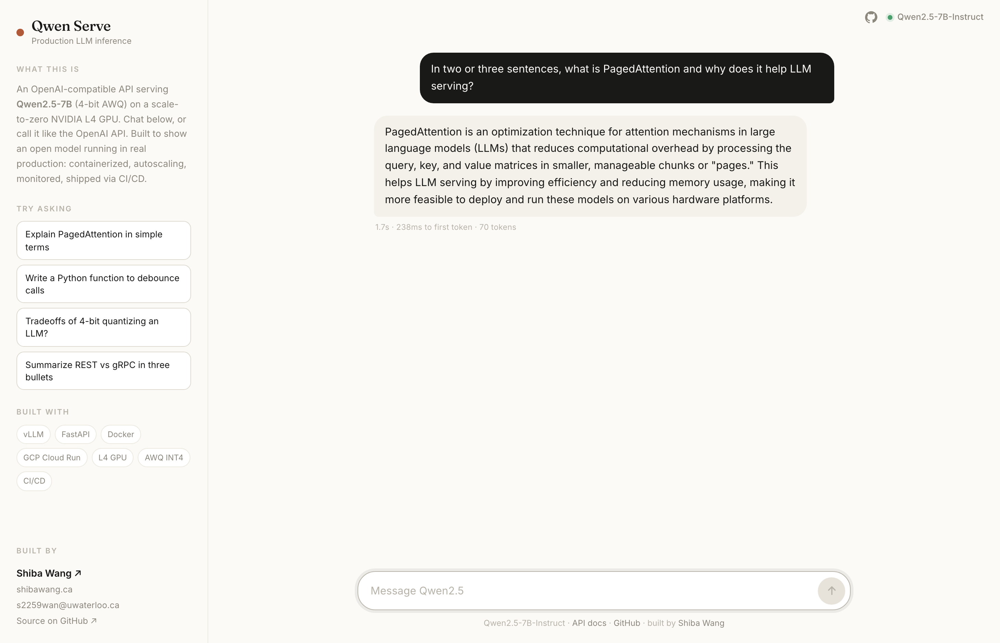
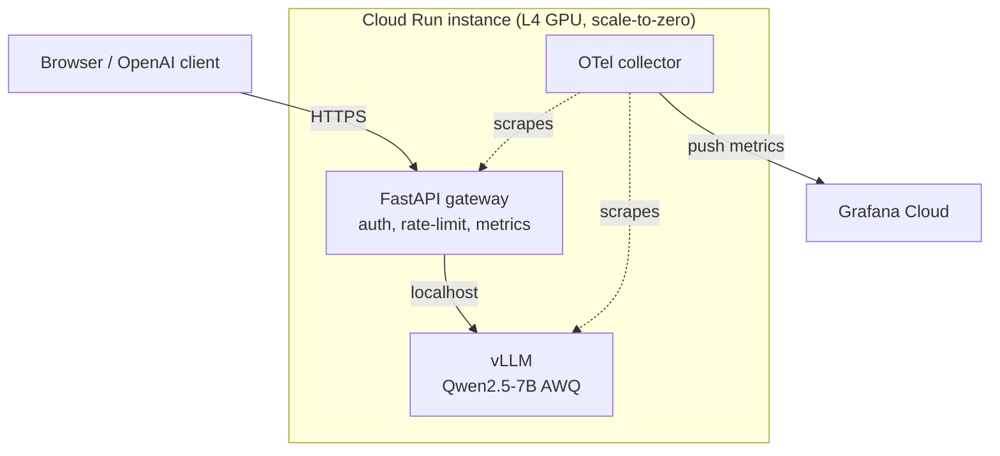
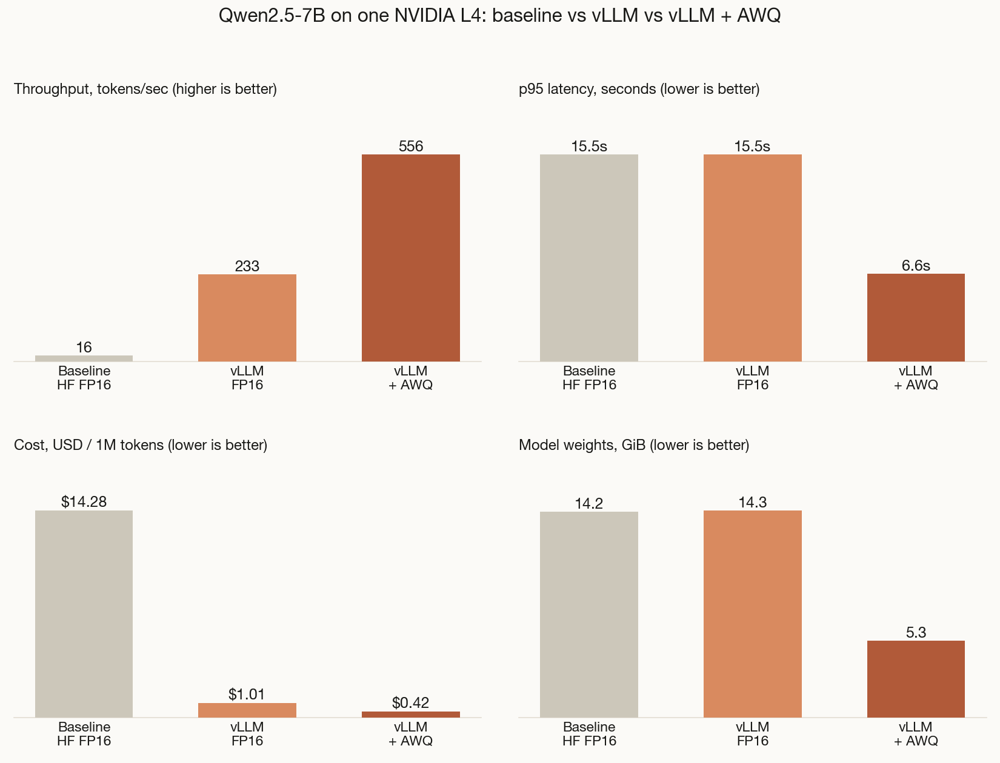

# Qwen Serve


A small but production-shaped LLM service. It runs Qwen2.5-7B on a cloud GPU and serves it through
an OpenAI-compatible API, with a chat UI on top. It scales to zero, so it costs about nothing when
nobody is using it.

Built by Shiba Wang. [shibawang.ca](https://shibawang.ca) · s2259wan@uwaterloo.ca

**Live demo:** https://qwen-serve-shibawang.netlify.app

Open it and start typing, no key needed. The service scales to zero, so when it has been idle your
visit wakes a GPU: the page shows a live wake-up screen with the real startup stages and unlocks
chat the moment the model is loaded and warmed — usually about 2 minutes, up to 3 on a fully cold
node. Once warm, replies stream immediately. The UI is static on Netlify and talks to the
OpenAI-compatible API at `https://llm-inference-2ieqajupeq-uc.a.run.app`.



## What it does

- Serves Qwen2.5-7B (4-bit AWQ) with vLLM on an NVIDIA L4 GPU.
- OpenAI-compatible, so any OpenAI client works. Just point it at the URL:
  ```bash
  curl $URL/v1/chat/completions \
    -H "Authorization: Bearer $KEY" -H "Content-Type: application/json" \
    -d '{"model":"Qwen2.5-7B-Instruct","messages":[{"role":"user","content":"hi"}],"stream":true}'
  ```
- Streaming (SSE) and non-streaming, API-key auth, rate limiting, health checks, Prometheus metrics.
- Scale to zero on Cloud Run, so idle cost is roughly $0. Cold starts are handled honestly: the UI
  narrates the real stages from `/health/ready` (instance → model load → kernel warmup), and the
  service reports ready only after a warmup completion, so the first real reply is fast.
- Ships through GitHub Actions: lint, type-check, test, build, deploy, smoke test, and a k6
  load-test gate.

## How it's built



The gateway (FastAPI) sits in front of vLLM's own OpenAI server. It does auth, rate limiting, and
metrics, then forwards the request to vLLM on localhost. Keeping vLLM behind its stable HTTP API
means version upgrades don't break us, and the whole gateway runs against a fake backend locally
with no GPU. More detail in [docs/architecture.md](docs/architecture.md).

| Layer | Tool |
|-------|------|
| Model | Qwen2.5-7B-Instruct, AWQ INT4 |
| Inference | vLLM (PagedAttention, continuous batching) |
| API + UI | FastAPI, plain HTML/JS chat |
| Container | Docker (CUDA base, weights baked in) |
| Deploy | GCP Cloud Run, L4 GPU, scale-to-zero |
| Metrics | Prometheus + OpenTelemetry, Grafana Cloud, Langfuse |
| CI/CD | GitHub Actions, Cloud Build |

## Run it locally (no GPU)

The gateway, UI, and tests run against a fake vLLM backend, so you can try the whole thing on a
laptop.

```bash
python3.12 -m venv .venv && source .venv/bin/activate
pip install -e ".[dev]"

# terminal 1: fake backend
uvicorn tools.fake_vllm:app --port 8000

# terminal 2: the gateway
DEMO_API_KEY=demokey uvicorn app.main:app --port 8080
```

Open http://localhost:8080 and chat. Run the checks with:

```bash
ruff check . && mypy app tools && pytest -q
```

## Deploy it

The full deploy needs a paid GCP account (GPUs are off on the free trial, but the $300 credit still
applies once you upgrade), plus free Grafana Cloud and Langfuse accounts. Step-by-step in
[docs/setup-guide.md](docs/setup-guide.md).

## Results

Before/after on the same NVIDIA L4, same prompt set. Baseline is plain HuggingFace FP16 (one
request at a time), then vLLM (continuous batching), then vLLM + AWQ 4-bit.

| Config | tokens/sec | p95 latency | Model weights | $/1M tokens | GSM8K |
|--------|-----------|-------------|---------------|-------------|-------|
| Baseline (HF FP16) | 16.5 | 15.5s | 14.2 GB | $14.28 | - |
| vLLM (FP16) | 233 | 15.5s | 14.3 GB | $1.01 | 80.0% |
| **vLLM + AWQ INT4** | **556** | **6.6s** | **5.3 GB** | **$0.43** | **87.5%** |



vLLM alone is about 14x the throughput of the naive baseline, just from continuous batching. AWQ on
top roughly halves the latency, cuts the weights to about a third, and brings cost down ~33x, with no
accuracy drop on GSM8K. Full method and commands in [docs/benchmarks.md](docs/benchmarks.md).

## Repo layout

```
app/          FastAPI gateway (config, schemas, auth, proxy, telemetry)
ui/           single-page chat demo
tools/        fake vLLM backend for local dev and tests
benchmarks/   baseline + vLLM benchmarks, k6 load test
deploy/       Dockerfile, entrypoint, Cloud Run + Cloud Build config
monitoring/   Grafana dashboard, alerts, OTel collector config
tests/        pytest suite (runs against the fake backend)
docs/         architecture, benchmarks, monitoring, setup guide
```
