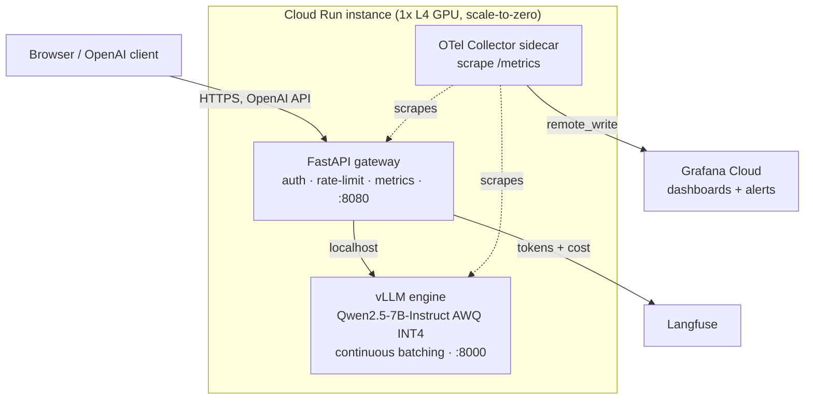

# LLM Inference Service — Qwen2.5-7B on Cloud Run (vLLM + FastAPI)


By [Shiba Wang](https://shibawang.ca) · s2259wan@uwaterloo.ca

Serve an open-source 7B LLM as a real production service: containerized, deployed live on
GCP Cloud Run with a scale-to-zero L4 GPU, monitored, performance-optimized, and shipped through
an automated CI/CD pipeline. Not a notebook demo, an actual running endpoint.

**Live demo:** https://YOUR_SERVICE_URL.run.app  (open it and start chatting, no key needed)

> Scale-to-zero means the first request after idle triggers a GPU cold start (~30-60s). After that
> it is fast. Costs ~$0 when nobody is using it.


---

## What this is

An OpenAI-compatible inference service. You can point any OpenAI client at it:

```bash
curl https://YOUR_SERVICE_URL.run.app/v1/chat/completions \
  -H "Authorization: Bearer $API_KEY" \
  -H "Content-Type: application/json" \
  -d '{"model":"Qwen2.5-7B-Instruct","messages":[{"role":"user","content":"Hello"}],"stream":true}'
```

It is built around four proof points:

1. **Live endpoint** — public HTTPS URL + a clickable chat UI, on Cloud Run with `min-instances=0`.
2. **Monitoring** — a Grafana dashboard (latency, throughput, cost, error rate) fed by a push-based
   OpenTelemetry sidecar, plus Langfuse for per-request token and cost tracking.
3. **Optimization** — a reproducible before→after benchmark: HF Transformers FP16 → vLLM →
   vLLM + AWQ INT4, measured on the same L4.
4. **CI/CD** — GitHub Actions: lint + type + test on PRs; build → deploy → smoke test → k6
   load-test gate on merge to main.

---

## Architecture



The gateway runs vLLM's own OpenAI server on localhost and sits in front of it. We depend on
vLLM's stable HTTP contract instead of its fast-moving Python internals, and the whole gateway can
run against a fake upstream with no GPU (handy for local dev and CI).

| Layer | Tool |
|-------|------|
| Model | Qwen2.5-7B-Instruct, AWQ INT4 (Apache-2.0) |
| Inference engine | vLLM (PagedAttention, continuous batching) |
| API gateway | FastAPI (async, SSE streaming, OpenAI-compatible) |
| Container | Docker (multi-stage, CUDA base, weights baked in) |
| Registry / deploy | GCP Artifact Registry + Cloud Run (L4 GPU, scale-to-zero) |
| Metrics / dashboards | Prometheus + OpenTelemetry → Grafana Cloud |
| LLM tracing / cost | Langfuse |
| Load testing | k6 |
| CI/CD | GitHub Actions |

See [docs/architecture.md](docs/architecture.md) for the request flow and design trade-offs.

---

## Results (before → after)

Measured on a single NVIDIA L4 (24 GB), fixed prompt set, warmup excluded. Reproduce with the
scripts in `benchmarks/` (see [docs/benchmarks.md](docs/benchmarks.md)). Numbers below are filled in
after running on the L4.

| Config | tokens/sec | p95 latency | req/sec @ concurrency | peak GPU mem | $/1M tokens | GSM8K acc |
|--------|-----------|-------------|-----------------------|--------------|-------------|-----------|
| Baseline (HF FP16, no batching) | _TBD_ | _TBD_ | _TBD_ | ~_TBD_ GiB | _TBD_ | _TBD_ |
| vLLM (FP16) | _TBD_ | _TBD_ | _TBD_ | ~_TBD_ GiB | _TBD_ | _TBD_ |
| vLLM + AWQ INT4 | _TBD_ | _TBD_ | _TBD_ | ~5.6 GiB | _TBD_ | _TBD_ |

Targets we expect to confirm: ~10-15x throughput under concurrency, ~65% lower GPU memory
(weights), ~3-4x cheaper per token, and < 2% accuracy drop from quantization.


*(Grafana dashboard screenshot — add after first run.)*

---

## Run it locally (no GPU needed)

The gateway, UI, and tests run against a fake vLLM upstream, so you can try the whole API layer on
a laptop without a GPU.

```bash
python3.12 -m venv .venv && source .venv/bin/activate
pip install -e ".[dev]"

# terminal 1: fake upstream (stands in for vLLM)
uvicorn tools.fake_vllm:app --port 8000

# terminal 2: the gateway (DEMO_API_KEY lets the UI work with no key prompt)
DEMO_API_KEY=demokey uvicorn app.main:app --port 8080
```

Open http://localhost:8080 for the chat UI (no key to enter, it just works), or curl it:

```bash
curl -N http://localhost:8080/v1/chat/completions \
  -H "Authorization: Bearer demokey" -H "Content-Type: application/json" \
  -d '{"model":"Qwen2.5-7B-Instruct","messages":[{"role":"user","content":"hi"}],"stream":true}'
```

Checks:

```bash
ruff check . && ruff format --check . && mypy app tools && pytest -q
```

## Deploy it for real (GPU on Cloud Run)

The full deploy needs a paid GCP account (GPUs are blocked on the free trial, though the $300
credit still applies once upgraded), plus Grafana Cloud and Langfuse free accounts. The whole
walk-through is in **[docs/setup-guide.md](docs/setup-guide.md)**.

---

## Repository layout

```
app/            FastAPI gateway (config, schemas, auth, rate-limit, proxy, telemetry)
ui/             single-page chat demo served by the gateway
tools/          fake vLLM upstream for local dev + tests
benchmarks/     baseline_hf.py, bench_vllm.py, accuracy.py, plot.py, loadtest.js (k6)
deploy/         Dockerfile, entrypoint, cloudrun.yaml, cloudbuild.yaml
monitoring/     otel-collector.yaml, grafana-dashboard.json, alerts.yaml
tests/          pytest suite (run against the fake upstream)
docs/           architecture, benchmarks, monitoring, setup guide
.github/        CI/CD workflow
```

## Design trade-offs

- **Gateway proxies vLLM's OpenAI server (vs. embedding the engine in-process).** More robust across
  vLLM upgrades and trivially testable without a GPU. Costs a sub-millisecond local hop.
- **Push-based metrics (sidecar) instead of pull scraping.** Scale-to-zero means there is nothing to
  scrape when idle, so an OTel Collector sidecar remote-writes to Grafana Cloud.
- **AWQ weights baked into the image.** Bigger image, but fast and reproducible cold starts and no
  dependency on pulling weights at runtime.
- **Scale-to-zero over a warm instance.** ~$0 idle at the cost of a cold start on the first request.

## Resume bullet

> Deployed an open-source 7B LLM (Qwen2.5) as a scale-to-zero, OpenAI-compatible inference service on
> GCP Cloud Run (vLLM + FastAPI, Dockerized, GitHub Actions CI/CD). Raised throughput ~__x and cut
> cost per 1M tokens ~__x via continuous batching + AWQ-INT4 quantization, with a Prometheus /
> Grafana + Langfuse dashboard tracking latency, throughput, cost, and error rate.
