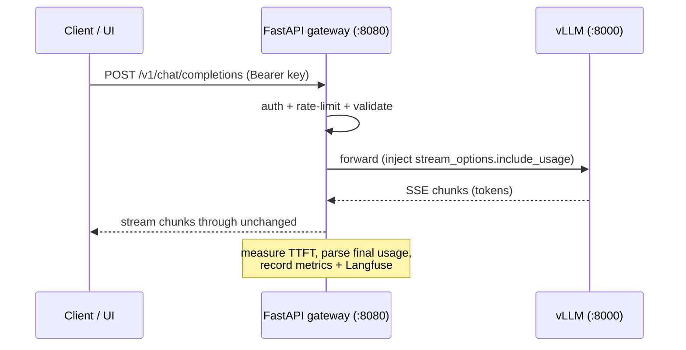

# Architecture

## Overview

One Cloud Run service runs three processes:

- **vLLM** — Qwen2.5-7B-Instruct (AWQ INT4) behind vLLM's own OpenAI-compatible server, bound to
  `127.0.0.1:8000`. This is the actual inference engine: PagedAttention, continuous batching.
- **FastAPI gateway** — the public face on `:8080`. Auth, rate limiting, request validation,
  gateway-level metrics, the demo UI, health probes. It proxies to vLLM.
- **OpenTelemetry Collector** — a sidecar container that scrapes both `/metrics` endpoints and
  remote-writes to Grafana Cloud.

## Request flow

For non-streaming requests the gateway forwards the request, reads the JSON response, records
latency and token usage, and returns it. For streaming, it passes the upstream SSE bytes straight
through for exact fidelity while parsing a decoded copy on the side to capture time-to-first-token
and the final `usage` block (it injects `stream_options.include_usage` so vLLM emits it).

## Why a gateway in front of vLLM

vLLM ships a perfectly good OpenAI server. We wrap it rather than embed `AsyncLLMEngine` in our own
process for three reasons:

1. **Upgrade robustness.** vLLM releases roughly every two weeks and its Python internals move with
   it. We depend only on its HTTP contract (the OpenAI API + `/metrics`), which is stable.
2. **Testability without a GPU.** The gateway talks to an upstream base URL. In local dev and CI we
   point it at `tools/fake_vllm.py`, so the entire API layer (auth, rate-limit, streaming, metrics)
   is exercised with no GPU and no model.
3. **Separation of concerns.** Auth, rate limiting, and gateway metrics live in our code; token
   generation lives in vLLM. Each can be changed independently.

The cost is one extra in-process hop over localhost, which is negligible next to token latency.

## Components (`app/`)

- `config.py` — settings from env / `.env` (pydantic-settings).
- `schemas.py` — OpenAI-compatible request models, permissive (extra fields pass through).
- `inference.py` — the proxy: streaming + non-streaming, TTFT and usage capture, readiness check.
- `telemetry.py` — Prometheus gateway metrics, OpenTelemetry setup, the Langfuse tracker.
- `main.py` — app factory, routes, auth dependency, rate limiter, UI, health probes.

## Security

- **API-key auth.** `Authorization: Bearer <key>` checked against an allow-list from Secret Manager.
  Auth is disabled only when no keys are configured (local dev), and logs a warning.
- **Rate limiting.** Per-key (or per-IP) via slowapi, in-process. Fine for a single-instance,
  scale-to-zero service; a shared store (Redis) would be the next step for multi-instance.
- **Cost guardrails.** Scale-to-zero, `max-instances` cap, request timeout, and the rate limit keep
  a runaway demo from running up a bill.

## Scale-to-zero implications

- **Cold start.** With `min-instances=0`, the first request after idle starts an instance, pulls the
  image, and loads the model into GPU memory (~30-60s). Weights are baked into the image so this is
  as fast and reproducible as it can be without paying for a warm GPU.
- **Metrics.** Pull-based Prometheus scraping can't reach an instance that doesn't exist. The OTel
  Collector sidecar lives and dies with the instance and pushes via remote-write; the
  `container-dependencies` annotation keeps it alive until the app has drained on shutdown.

## Container

Multi-stage build on `vllm/vllm-openai` (CUDA 12.9). The gateway's dependencies install into an
isolated venv (`/opt/gw`) so they can't clash with vLLM's pinned versions; the two processes share
the container but not their Python environments. The entrypoint starts vLLM in the background and
runs the gateway in the foreground as PID 1, so it receives Cloud Run's SIGTERM and flushes
telemetry on shutdown. Cloud Run's startup probe hits the gateway's `/health/ready`, which reports
ready only once vLLM has loaded the model.
